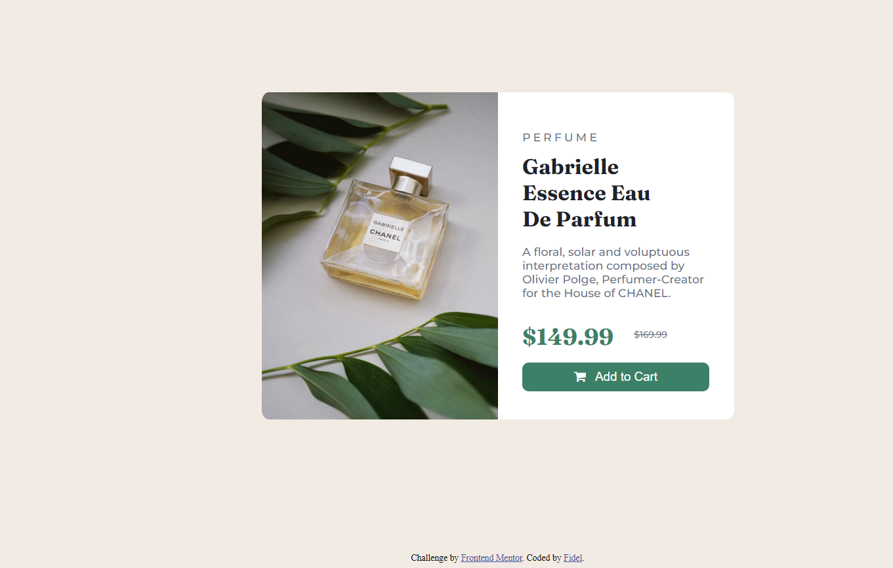

# Frontend Mentor - Product preview card component solution

This is a solution to the Product preview card component challenge on Frontend Mentor(https://www.frontendmentor.io/challenges/product-preview-card-component-GO7UmttRfa). Frontend Mentor challenges help you improve your coding skills by building realistic projects. 

## Table of contents

- [Overview](#overview)
  - [The challenge](#the-challenge)
  - [Screenshot](#screenshot)
  - [Links](#links)
- [My process](#my-process)
  - [Built with](#built-with)
  - [What I learned](#what-i-learned)
  - [Continued development](#continued-development)
- [Author](#author)

## Overview

### The challenge

Users should be able to:

- View the optimal layout depending on their device's screen size
- See hover and focus states for interactive elements

### Screenshot
Desktop:

Mobile:

### Links

- Solution URL: [https://github.com/baxtro/product-preview-card]
- Live Site URL: [https://baxtro.github.io/product-preview-card/]

## My process

### Built with

- HTML, CSS, and a 1st attempt at flexbox

### What I learned and some useful resources

For this challenge I tried my hand at flexbox, and using a media query to change from horizontal to vertical for mobile. This was particularly tricky for me, and I also tried the html "picture" tag, but couldn't really get it to work the way I wanted. I learned alot, watched a few flexbox tutorials, and spent a lot of time at W3 Schools. Definitely got really frustrated at times, but I'm pretty happy with the outcome, so I'm posting it!

### Continued development

I plan on working more with flexbox and getting more comfortable with it. I"m still not sure I am implementing it right or fully understanding it. Then I'd like to try my hand at Bootstrap.

## Author

- Frontend Mentor - [@baxtro](https://www.frontendmentor.io/profile/baxtro)

